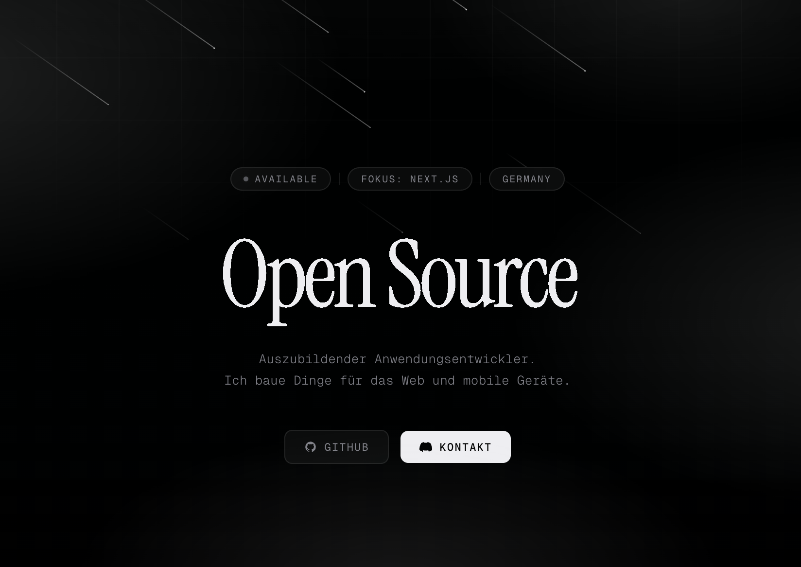

# hrmtm.de

Personal portfolio — built with zero dependencies.

→ **[hrmtm.de](https://hrmtm.de)**

---

## About

Single-file portfolio site with a cinematic dark aesthetic. No framework, no build step, no dependencies — just HTML, CSS and vanilla JavaScript deployed directly to Vercel.

## Features

- **Gooey text morphing** — smooth SVG filter-based transition between words
- **Meteor rain** — randomized CSS animation, 32 meteors with varying size and tail length
- **Mouse-tracking glow** — per-card radial gradient that follows the cursor
- **Scroll reveal** — IntersectionObserver-based fade-in for sections
- **Responsive** — mobile-first layout down to 375px

## Stack

| | |
|---|---|
| Markup | HTML |
| Styling | CSS (custom properties, `oklch` color space) |
| Logic | Vanilla JavaScript |
| Fonts | Instrument Serif · Geist Mono |
| Hosting | Vercel |

## Structure

```
portfolio/
├── index.html   # everything — markup, styles, scripts
└── public/
    └── preview.png
```

## Local development

No install needed — open `index.html` directly in the browser.

```bash
git clone https://github.com/hrmtm/portfolio
open index.html
```

---

Built by [hrmtm](https://hrmtm.de)
